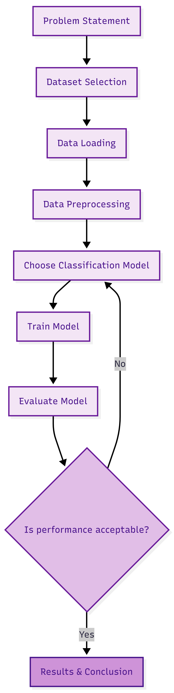

# ml_Lab2
# ARTI 308 – Machine Learning Lab 2  
## Customer Churn Prediction Project

## Dataset Summary

**Dataset Name:** Telco Customer Churn Dataset  
**Source:** Kaggle  
**Data Type:** Tabular Data (CSV format)  
**Machine Learning Task:** Supervised Learning – Classification  

This dataset contains customer information from a telecommunications company. 
It includes features such as gender, tenure, contract type, monthly charges, 
total charges, and payment method.

The dataset is structured in rows and columns and is suitable for machine learning analysis.

The target variable is **Churn**, where:
- Yes = Customer left the company
- No = Customer stayed

## Problem Definition

This project addresses a binary classification problem.

The objective is to predict whether a customer is likely to leave the company 
based on their account information and service usage.

Since the target variable (Churn) has two possible categories (Yes or No), 
this problem falls under supervised classification.

The model is expected to learn patterns between customer features 
(e.g., contract type, monthly charges, tenure) and churn behavior. 
After training, the model should be able to predict whether a new customer 
is likely to churn.

## Target Variable

**Name:** Churn  
**Type:** Categorical (Binary)  
**Values:** Yes (Churn), No (Stay)

## Expected Learning Outcome

The model will learn which customer characteristics are associated 
with higher churn probability and use that knowledge to predict churn 
for unseen customers.

## Methodology Diagram

The methodology diagram was generated using Mermaid Live Editor 
to visually represent the machine learning workflow. 
Artificial intelligence assistance was used to help structure 
and format the workflow diagram clearly and professionally.
